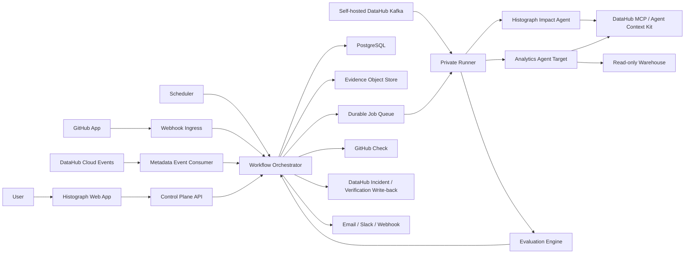
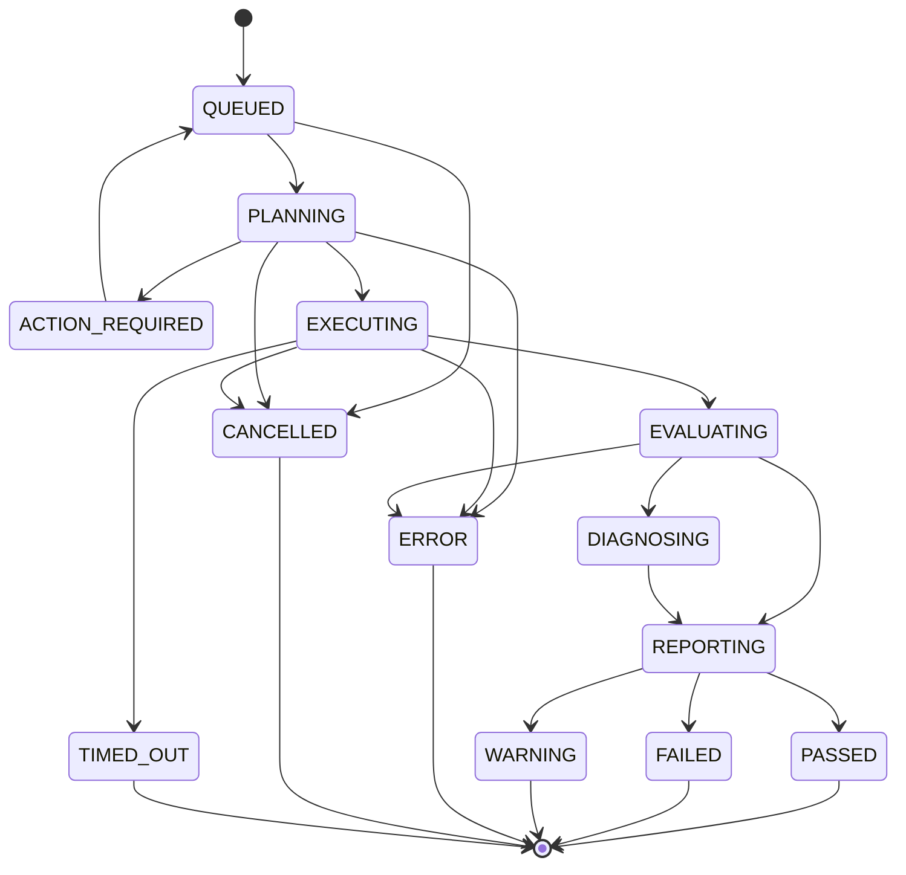

# Histograph Product and System Specification

**Status:** Authoritative build specification

**Product:** Histograph

**Category:** Continuous assurance for data and analytics agents

**Primary integration:** DataHub

This document is the source of truth for Histograph's product behavior, system architecture, workflows, security boundaries, interfaces, data model, and acceptance criteria. Product and engineering decisions must remain consistent with this specification unless this document is deliberately revised.

---

## 1. Product definition

Histograph is a continuous assurance platform for data and analytics agents.

It detects when a code, metadata, model, prompt, permission, or live data-context change causes an analytics agent to produce a silently wrong answer. Histograph uses DataHub's metadata graph to understand the affected schemas, fields, lineage, glossary terms, owners, and downstream assets; selects the protected business questions that are at risk; reruns those questions against the configured agent; evaluates the agent's selected assets, generated SQL, result contract, and final claims; and publishes an auditable pass or failure.

Histograph integrates with GitHub as a check provider, with DataHub as the organizational context and metadata-event source, and with the DataHub Analytics Agent or another supported analytics agent as the system under test.

### 1.1 Product promise

> Histograph catches successful-looking but semantically wrong analytics-agent answers before users trust them.

### 1.2 Positioning

Histograph is CI/CD for data agents, not another data catalog and not another general-purpose agent observability product.

DataHub answers:

- What data assets exist?
- What are their schemas and definitions?
- How are they connected?
- Who owns them?
- What changed?

Histograph answers:

- Which protected agent behaviors are affected by this change?
- Does the agent still choose the correct assets and business definitions?
- Is the generated SQL still semantically correct?
- Does the result still satisfy the approved contract?
- Should this pull request, deployment, or live context change pass or fail?
- What exactly regressed, who owns it, and what evidence supports the diagnosis?

### 1.3 Core differentiation

DataHub records and emits metadata changes. Histograph consumes that context to run behavioral regressions against agents.

GitHub emits code-change events. Histograph consumes the diff and DataHub graph to build a metadata-aware test plan.

Agent-observability tools record what an agent did. Histograph actively executes protected questions and determines whether the resulting behavior is still correct.

### 1.4 Non-goals

Histograph is not:

- A replacement for DataHub.
- A warehouse, query engine, or data-transformation system.
- A generic LLM tracing platform.
- A traditional row-level data-quality monitor.
- A model provider.
- A general code-generation product.
- A system that lets an LLM alone decide merge safety.
- A system that modifies a customer's source code or approved baselines without explicit authorization.

---

## 2. Product principles

1. **Context before judgment.** Every impact decision and diagnosis must be grounded in DataHub assets, fields, lineage, definitions, and ownership where available.
2. **Deterministic gates, agentic investigation.** Agents investigate, plan, and explain. Deterministic evaluators own hard pass/fail assertions wherever possible.
3. **Evidence over confidence.** Every selected test, exclusion, failure, and diagnosis must link to concrete evidence.
4. **No silent skipping.** Unknown mappings or unavailable dependencies must be visible and must follow an explicit conservative policy.
5. **Least privilege by default.** The GitHub App is read-only except for checks and comments. Warehouse access is read-only. DataHub write access is limited to Histograph-owned records and incidents.
6. **Customer data stays within declared boundaries.** Private runners execute inside the customer's network. Raw result storage is opt-in and retention-controlled.
7. **Every run is reproducible.** Histograph records the commit, agent version, model, prompt fingerprint, test version, baseline version, DataHub snapshot references, and evaluator version.
8. **Human approval for semantic truth.** Histograph may propose assertions and baseline updates, but an authorized reviewer approves them.
9. **Changes supersede stale work.** A newer pull-request commit cancels or supersedes older runs for the same pull request.
10. **Write-back must be useful.** Histograph writes actionable, deduplicated incidents and verification evidence to DataHub rather than noisy status spam.

---

## 3. Users and roles

### 3.1 Organization Owner

- Creates and manages the Histograph organization.
- Configures authentication, retention, and organization-wide security settings.
- Installs or removes the GitHub App.
- Authorizes DataHub connections and private runners.
- Assigns roles.

### 3.2 Project Administrator

- Creates projects and selects repositories.
- Configures agent targets, test suites, triggers, schedules, and notifications.
- Sets branch-protection expectations.
- Manages project-level secrets and retention policies.

### 3.3 Data or Analytics Engineer

- Creates and maintains protected questions.
- Reviews proposed asset mappings and assertions.
- Investigates regressions.
- Updates transformations or metadata and reruns checks.

### 3.4 Agent Owner

- Registers an analytics-agent target.
- Controls its version, prompt, tool configuration, model configuration, and execution mode.
- Reviews agent-specific regressions and stability results.

### 3.5 Reviewer

- Approves baselines and baseline changes.
- Acknowledges accepted behavioral changes.
- Resolves or reopens regressions.

### 3.6 Read-only Observer

- Views projects, runs, evidence, and incidents.
- Cannot change configuration, rerun tests with altered settings, or approve baselines.

### 3.7 Service identities

- GitHub App installation identity.
- DataHub service account.
- Histograph private-runner identity.
- Notification-webhook identity.
- Internal workflow and scheduler identities.

---

## 4. Key concepts

### 4.1 Organization

A tenant boundary containing users, projects, billing, authentication, audit records, encryption keys, and retention policies.

### 4.2 Project

The unit that connects repositories, one DataHub environment, one or more agent targets, protected-question suites, triggers, and notification routes.

### 4.3 Agent target

An analytics agent Histograph can invoke and inspect. The first-class target is the open-source DataHub Analytics Agent. All targets implement the Histograph Agent Adapter interface.

### 4.4 Protected question

A versioned business question with approved semantic expectations. A protected question is executable and has one or more assertions.

### 4.5 Baseline

An approved successful execution of a protected question, including the context dependencies, normalized SQL semantics, result contract, response contract, and environment fingerprints used for future comparison.

### 4.6 Asset reference

A stable DataHub URN referring to a dataset, field, chart, dashboard, data job, ML asset, glossary term, document, or other supported entity.

### 4.7 Impact plan

The structured output produced by the Histograph Impact Agent. It identifies changed assets, affected tests, excluded tests, unknowns, risk level, and evidence.

### 4.8 Evaluation

The set of deterministic and assisted checks applied to one test execution.

### 4.9 Run

One Histograph workflow initiated by a pull request, push, metadata event, schedule, manual request, or API call.

### 4.10 Regression

A material deviation from approved behavior. Regressions include wrong asset selection, semantic SQL changes, invalid result contracts, incorrect claims, missing citations, execution failures, and excessive instability.

### 4.11 DataHub incident

A deduplicated live-environment failure record linked to the affected DataHub assets. Pull-request failures do not create production incidents unless the same failure exists in a live environment.

---

## 5. System architecture

Histograph consists of a multi-tenant control plane, an execution plane, external integrations, and durable evidence storage.



### 5.1 Control plane

The control plane owns:

- Organizations, projects, memberships, and RBAC.
- GitHub installations and repository mappings.
- DataHub connection metadata and capability state.
- Agent-target registrations.
- Test suites, protected questions, assertions, and baselines.
- Trigger and schedule definitions.
- Durable workflow coordination.
- Run state and evidence indexes.
- GitHub Checks and notifications.
- Audit logs, retention, and incident coordination.

The control plane must not require direct warehouse access in private-runner mode.

### 5.2 Execution plane

The execution plane runs untrusted or customer-specific operations:

- Repository checkout and diff inspection.
- dbt parsing or compilation.
- Proposed-metadata overlay construction.
- DataHub context queries.
- Analytics-agent invocation.
- Read-only warehouse queries executed by the agent target.
- Trace capture and redaction.
- SQL normalization and deterministic evaluation.
- Result-contract evaluation.

Execution occurs in isolated, ephemeral jobs. Private runners perform these jobs inside the customer's network and connect outbound to the Histograph control plane.

### 5.3 Persistence

- **PostgreSQL:** transactional configuration, run state, test definitions, baselines, evidence indexes, audit events, and incident state.
- **S3-compatible object storage:** encrypted large artifacts such as traces, normalized query plans, redacted result samples, compiled manifests, and reports.
- **Durable workflow engine:** long-running workflows, retries, timers, cancellation, and compensation.
- **Cache/lock service:** rate limits, short-lived locks, idempotency acceleration, and live UI streams. PostgreSQL remains the source of truth.

### 5.4 Reference implementation stack

- Web application: Next.js, React, and TypeScript.
- Control Plane API: Python and FastAPI.
- Data access: SQLAlchemy and Alembic.
- Durable workflows: Temporal.
- Database: PostgreSQL.
- Object storage: S3-compatible storage.
- Runner and agents: Python containers.
- SQL analysis: sqlglot with dialect-specific adapters.
- DataHub access: Agent Context Kit, MCP Server, and DataHub SDK where required for supported write-back operations.
- GitHub integration: GitHub App APIs and Checks API.
- Authentication: OIDC-compatible authentication with organization SSO support.
- Telemetry: OpenTelemetry-compatible traces, metrics, and structured logs.

---

## 6. Trust and deployment modes

### 6.1 Managed execution

Histograph operates the execution workers. Customers authorize DataHub, the agent target, the model provider, and the read-only warehouse connection. Credentials are envelope-encrypted and scoped to one organization and environment.

Managed execution is appropriate when the connected systems are publicly reachable through approved secure endpoints.

### 6.2 Private-runner execution

The customer deploys the Histograph Runner in its own VPC, Kubernetes cluster, or controlled host.

The runner:

- Uses outbound TLS connections only.
- Authenticates using a project-scoped runner credential.
- Retrieves short-lived signed jobs.
- Reads secrets from the customer's secret manager or environment.
- Connects privately to DataHub, the analytics agent, GitHub, and the warehouse.
- Redacts and summarizes evidence before upload.
- Never exposes an inbound execution endpoint to the Histograph control plane.

Private-runner mode is the default production recommendation for private warehouses and self-hosted DataHub.

### 6.3 Demo and sandbox environments

Public evaluation environments use synthetic data, a dedicated DataHub instance, a dedicated analytics-agent target, and isolated repositories. Sandbox data and credentials are never shared with production tenants.

### 6.4 Environment separation

Projects explicitly identify an environment such as development, staging, or production. DataHub URNs, runner credentials, agent targets, incidents, and baselines are environment-scoped. Histograph must not apply a staging baseline to a production target without an explicit promotion action.

---

## 7. One-time onboarding workflow

### 7.1 Create organization and project

1. The user signs in and creates or joins an organization.
2. An Organization Owner creates a project.
3. The project receives a name, stable slug, environment, timezone, retention policy, and default trigger policy.
4. Histograph records the creator and all configuration changes in the audit log.

### 7.2 Install the Histograph GitHub App

1. The user selects **Connect GitHub**.
2. GitHub presents the Histograph GitHub App installation screen.
3. The user selects an organization or account and grants access to all repositories or selected repositories.
4. GitHub redirects to Histograph with the installation identifier.
5. Histograph retrieves only the repositories available to that installation.
6. The user associates one or more repositories with the project.
7. Histograph verifies webhook delivery and Check Run permissions.

No Histograph package, workflow, or source file is required in the customer's repository. Dashboard configuration is authoritative. An optional `.histograph.yml` may export or mirror non-secret configuration for GitOps use, but it is not required for operation.

### 7.3 Connect DataHub

The user selects one connection mode:

#### DataHub Cloud

1. Provide the DataHub Cloud organization URL.
2. Authorize a DataHub service account or provide a project-scoped token.
3. Grant read access to metadata and lineage.
4. Grant the platform privilege required to consume events.
5. Grant limited write access for Histograph-managed incidents and verification records.
6. Histograph tests search, entity retrieval, lineage traversal, event consumption, and permitted write-back.

#### Self-hosted DataHub

1. Register the DataHub base URL and deployment identifier.
2. Deploy or select a Histograph private runner with access to DataHub.
3. Configure the runner with the DataHub token and, for real-time events, Kafka and schema-registry connectivity.
4. Histograph validates the connection through the runner.
5. The runner begins consuming the configured DataHub Metadata Change Log and Entity Change Event topics.

The UI presents this as **Connect DataHub**. MCP endpoints, Kafka topics, schema registries, and credentials are advanced connection details rather than the primary product workflow.

### 7.4 Register an analytics-agent target

The user selects **Add agent target** and chooses an adapter.

#### DataHub Analytics Agent

1. Select managed or private-runner execution.
2. Register the Analytics Agent base URL and authentication method, or provision a managed target.
3. Verify DataHub context access.
4. Verify the configured query engine and read-only warehouse identity.
5. Verify model-provider configuration.
6. Run a health check and a non-destructive diagnostic question.
7. Record supported capabilities, agent version, prompt fingerprint, model identifiers, enabled tools, and connection identifiers.

#### Custom analytics agent

The target must implement the Histograph Agent Adapter contract defined in this specification. It must expose health, session, invocation, streaming trace, cancellation, and capability operations.

### 7.5 Create protected questions

Protected questions can be created by:

- Promoting a successful analytics-agent conversation.
- Importing selected historical conversations.
- Creating a question manually.
- Importing a versioned suite through the Histograph API.

For each question, Histograph captures an execution, extracts candidate dependencies and assertions, and requires reviewer approval before the baseline becomes active.

### 7.6 Configure triggers

The user configures:

- Pull-request events.
- Pushes to protected branches.
- DataHub metadata events.
- Manual and API-triggered runs.
- Timezone-aware schedules.
- Trigger filters and concurrency policies.
- Notification routes.
- Required GitHub status checks.

### 7.7 Establish the first baseline

1. Histograph executes every protected question in a controlled environment.
2. The runner captures the DataHub assets, fields, glossary terms, tool calls, normalized SQL, result contract, response claims, and environment fingerprint.
3. Histograph proposes assertions.
4. An authorized reviewer edits or approves the assertions.
5. The reviewer approves the baseline.
6. Histograph versions the test and baseline immutably.

---

## 8. Protected-question specification

Every protected question contains:

- Stable test identifier.
- Human-readable name.
- Question text.
- Description and business purpose.
- Owner and reviewers.
- Suite membership and criticality.
- Agent target and environment.
- Optional setup conversation or prior turns.
- Time anchoring policy.
- DataHub asset scope.
- Required, allowed, and forbidden assets.
- Required glossary terms or metric definitions.
- SQL-semantic assertions.
- Result-contract assertions.
- Final-response assertions.
- Stability policy.
- Timeout and cost limits.
- Active baseline version.
- Tags and notification policy.

### 8.1 Time anchoring

Questions such as “last month” are nondeterministic unless anchored. Histograph supports:

- Fixed evaluation timestamp.
- Relative time evaluated at run time.
- Fixture-specific time.
- Business-calendar references.

Baselines record the chosen policy. Fixed-time tests must not silently move with the current date.

### 8.2 Asset assertions

- `requires_asset`: the execution must use the specified dataset, field, or semantic asset.
- `allows_asset`: the asset may be used but is not required.
- `forbids_asset`: the execution must not use a deprecated, sensitive, or semantically incorrect asset.
- `requires_any_of`: at least one asset from a set must be used.
- `requires_lineage_path`: the selected source must lie on an approved DataHub lineage path.
- `requires_term`: the interpretation must use the specified glossary term or metric definition.

### 8.3 SQL-semantic assertions

Histograph parses SQL into a dialect-normalized abstract syntax tree. Supported assertions include:

- Referenced tables and columns.
- Join relationships and join types.
- Required filters and forbidden filters.
- Aggregations and grouping keys.
- Window functions.
- Metric formulas.
- Time-range semantics.
- Null handling.
- Deduplication behavior.
- Currency and unit conversions.
- Required refund, cancellation, or status treatment.
- Query safety and read-only enforcement.
- Maximum scan or cost policy where the engine supplies estimates.

Formatting differences, aliases, predicate order, and equivalent syntax do not fail a semantic comparison.

### 8.4 Result-contract assertions

- Required column names and logical types.
- Row-count constraints.
- Uniqueness constraints.
- Nullability limits.
- Numeric range or tolerance.
- Aggregate reconciliation.
- Allowed category set.
- Ordering requirements.
- Snapshot hash for fixed fixtures.
- Distribution or stability bounds.
- Custom deterministic validator executed in the runner sandbox.

Exact result equality is not the default for live data. Tests must use fixed fixtures, fixed time windows, or explicit tolerances when exact values are required.

### 8.5 Final-response assertions

- Required claims.
- Forbidden claims.
- Required units and time period.
- Required source attribution or DataHub asset citations.
- Required uncertainty language when evidence is incomplete.
- Prohibition on unsupported causal or explanatory claims.
- Response-shape requirements such as table, scalar, or chart.

An LLM-assisted rubric may score narrative quality, but hard failures require deterministic evidence or a reviewer-approved rubric with a configured threshold and recorded judge configuration.

### 8.6 Stability assertions

Histograph can execute a question multiple times to measure:

- Asset-selection consistency.
- SQL-semantic consistency.
- Result-contract consistency.
- Final-answer consistency.
- Latency and token-cost variance.

A stability policy defines sample count, required pass rate, and maximum variance.

### 8.7 Baseline changes

A baseline update is a reviewed semantic change, not a retry mechanism.

The approval view must show:

- Old and new asset dependencies.
- Old and new normalized SQL semantics.
- Old and new result contracts.
- Old and new response requirements.
- The triggering change and reviewer justification.
- The reviewer identity and timestamp.

Approved baseline versions are immutable. Rollback creates a new active pointer; it does not alter history.

---

## 9. Trigger model

Histograph supports five first-class trigger types.

### 9.1 Pull-request trigger

Runs on configured GitHub pull-request actions:

- `opened`
- `reopened`
- `synchronize`
- `ready_for_review`
- Requested rerun from a Histograph Check

Draft pull requests follow the project's draft policy. A newer commit supersedes active runs for older commits on the same pull request.

### 9.2 Protected-branch push trigger

Runs after pushes or merges to selected branches. It verifies the deployed branch state and can reconcile results with the pull-request run.

### 9.3 DataHub metadata-event trigger

Runs when DataHub emits a relevant Metadata Change Log or Entity Change Event. Events are batched, deduplicated, classified, and mapped to protected questions.

### 9.4 Scheduled trigger

Runs a selected suite on a timezone-aware cron schedule. Scheduled runs detect regressions caused by model updates, agent configuration changes, permission changes, warehouse-data changes, nondeterminism, and external dependencies even when no Git or metadata event exists.

### 9.5 Manual or API trigger

An authorized user or system can run a project, suite, test, pull-request commit, asset scope, or explicit test selection. The initiator and supplied overrides are audited.

---

## 10. Pull-request workflow

### 10.1 Receive and authenticate

1. GitHub sends a webhook to Histograph.
2. Histograph verifies the webhook signature before parsing the payload.
3. The webhook delivery identifier becomes an idempotency key.
4. Histograph verifies the installation, organization, repository, and project mapping.
5. Histograph acknowledges the webhook quickly and creates a durable workflow.
6. A queued GitHub Check is created for the exact commit SHA.

### 10.2 Acquire the proposed change

1. The runner receives a signed, leased job.
2. It retrieves the pull-request metadata and changed-file list.
3. It checks out the exact head SHA into an isolated workspace.
4. It verifies repository identity and commit reachability.
5. It computes a normalized diff against the configured base SHA.
6. Generated artifacts are accepted only when their provenance matches the commit.

### 10.3 Classify the change

The runner classifies files into:

- dbt models, macros, seeds, snapshots, sources, and project configuration.
- Data pipeline definitions.
- Schema and semantic-model definitions.
- Analytics-agent source code.
- Prompts and instructions.
- Tool definitions and permissions.
- Model-provider and runtime configuration.
- Protected-question or assertion configuration.
- Documentation and glossary sources.
- Unrelated files.

Classification produces evidence and confidence. Unknown high-impact files use the conservative project policy, which defaults to running the broader affected suite rather than skipping.

### 10.4 Build proposed metadata overlay

DataHub normally describes the current ingested environment, while a pull request describes a proposed future state. Histograph therefore builds an overlay:

1. Parse the base and head project metadata.
2. For dbt repositories, run a controlled `dbt parse` or equivalent adapter to produce manifests for both revisions.
3. Compute added, removed, and changed nodes, fields, dependencies, and semantic definitions.
4. Resolve nodes to existing DataHub URNs using platform, environment, database, schema, model identifiers, and repository mappings.
5. Represent new or renamed assets as proposed URNs until they exist in DataHub.
6. Combine the proposed graph delta with the current DataHub graph for impact planning.
7. Record unmapped nodes explicitly.

Repository parsing executes without write credentials and within resource-constrained isolation. Projects may pin approved parser images and dependency locks.

### 10.5 Produce an impact plan

The Histograph Impact Agent receives:

- Trigger and repository metadata.
- Normalized diff classification.
- Proposed metadata overlay.
- Baseline dependency index.
- Project test policy.

It uses DataHub through the Agent Context Kit or MCP Server to inspect relevant assets, schemas, fields, lineage, glossary terms, documentation, deprecation state, ownership, and query context.

The output is a structured `ImpactPlan` containing:

```json
{
  "trigger": "github_pull_request",
  "changed_assets": [],
  "proposed_assets": [],
  "downstream_assets": [],
  "selected_tests": [],
  "excluded_tests": [],
  "unknown_mappings": [],
  "risk_level": "low | medium | high | critical",
  "evidence": [],
  "selection_policy_version": "string"
}
```

Selection rules include:

- A test is selected when its baseline dependencies include a changed asset or field.
- A test is selected when a changed asset is upstream of a baseline dependency.
- A test is selected when an approved business term, metric, documentation source, or query context it depends on changes.
- All applicable tests are selected when the agent's global prompt, model, toolset, query engine, or shared runtime changes.
- Unmapped high-risk changes select the complete relevant suite.
- Exclusions require an evidence-backed reason.

### 10.6 Execute selected tests

For every selected protected question:

1. Create an isolated agent session.
2. Apply the test's time anchor, context scope, model policy, and limits.
3. Invoke the configured agent target.
4. Stream and capture tool calls, DataHub asset accesses, generated SQL, query execution metadata, result schema, redacted result evidence, response content, errors, latency, and cost.
5. Enforce read-only query policy and execution limits.
6. Retry only failures classified as transient and only within the test's retry policy.
7. Preserve each attempt separately.

### 10.7 Evaluate

The Evaluation Engine applies checks in this order:

1. Invocation and protocol health.
2. Tool and permission errors.
3. DataHub asset selection.
4. SQL safety and parsing.
5. SQL-semantic assertions.
6. Result-contract assertions.
7. Final-response assertions.
8. Stability requirements.
9. Latency and cost budgets.
10. Assisted diagnosis and narrative scoring.

Hard deterministic failures cannot be overridden by an assisted score. Every failure includes actual value, expected value, evidence reference, evaluator version, and severity.

### 10.8 Diagnose

When a test fails, the Histograph Diagnostic Agent receives the impact plan, baseline, current trace, normalized SQL diff, result-contract diff, and relevant DataHub context. It produces:

```json
{
  "regression_type": "asset | sql | result | response | execution | stability",
  "summary": "string",
  "root_cause": "string",
  "affected_assets": [],
  "owners": [],
  "evidence": [],
  "recommended_actions": [],
  "confidence": 0.0
}
```

The diagnosis explains evidence; it does not replace failed assertions.

### 10.9 Publish the GitHub Check

The Check Run is attached to the exact commit and reports:

- Overall conclusion.
- Tests selected, passed, failed, skipped, and errored.
- Why each test was selected.
- Changed and downstream DataHub assets.
- Concise failure summaries.
- Links to Histograph run evidence.
- Rerun and open-dashboard actions.

Conclusions are:

- `success`: all required selected tests passed.
- `failure`: at least one required assertion failed.
- `neutral`: only non-blocking warnings occurred.
- `action_required`: a mapping, baseline, authorization, or reviewer decision is required.
- `cancelled`: superseded or explicitly cancelled.
- `timed_out`: the configured run deadline expired.

### 10.10 Write-back policy for pull requests

Pull-request failures remain in GitHub and Histograph because the proposed state is not yet live. Histograph may attach a verification reference to affected DataHub assets when configured, but it must not create a production incident solely for an unmerged change.

After merge, the protected-branch or metadata-event workflow reconciles the live state and creates an incident only if the failure exists in that environment.

---

## 11. DataHub metadata-event workflow

### 11.1 Event sources

Histograph uses DataHub's supported real-time event mechanisms:

- DataHub Cloud Event Source for DataHub Cloud.
- Kafka Event Source for self-hosted DataHub.
- Metadata Change Log events for aspect-level metadata changes.
- Entity Change Events for normalized entity changes where appropriate.

Scheduled metadata polling is not the standard event path.

### 11.2 Consume and checkpoint

1. Authenticate the event consumer.
2. Receive the event with its source offset or cursor.
3. Persist an idempotency fingerprint.
4. Validate tenant and environment routing.
5. Classify the entity, aspect, operation, and version.
6. Batch related changes within a configured debounce window.
7. Commit the source offset only according to the event source's acknowledged-processing semantics.

### 11.3 Relevant metadata changes

Relevant changes include:

- Dataset or field schema changes.
- Upstream or downstream lineage changes.
- Dataset, field, glossary, or documentation changes.
- Deprecation changes.
- Ownership changes that affect routing or approval.
- Data-quality assertion or contract changes.
- Semantic-model and metric-definition changes.
- Query-context changes.
- ML metadata changes when an agent target or protected question depends on them.

High-volume timeseries changes require explicit filters and aggregation policies.

### 11.4 Select and execute tests

1. Resolve the changed entity URNs.
2. Traverse relevant lineage and relationships.
3. Query the baseline dependency index.
4. Ask the Impact Agent to produce an evidence-backed selection.
5. Execute the selected questions against the live agent target.
6. Evaluate and diagnose using the same engine as pull-request runs.

### 11.5 Live incident lifecycle

For a required live-environment failure:

1. Compute a stable incident fingerprint from project, environment, test, assertion, and affected asset.
2. Create or update a Histograph incident in the control plane.
3. Create or update the corresponding DataHub incident linked to affected assets.
4. Add the failure evidence, run URL, owner routing, and recommended action.
5. Notify configured routes.
6. Deduplicate subsequent equivalent failures into the existing incident.
7. Resolve the incident after the configured number of consecutive successful verification runs.
8. Reopen it if the same regression returns.

Histograph writes only records it owns and records every write in the audit log.

---

## 12. Scheduled and manual workflows

### 12.1 Schedule configuration

A schedule includes:

- Name and description.
- Timezone and cron expression.
- Project, suite, test, tag, owner, or asset scope.
- Agent target and environment.
- Concurrency policy.
- Stability sample count.
- Cost and time budgets.
- Notification and incident policy.

### 12.2 Scheduled run

1. The durable scheduler emits a trigger at the calculated instant.
2. Histograph creates a run from the active versioned schedule.
3. The selection policy chooses the configured tests.
4. Tests execute and evaluate normally.
5. Live failures follow the incident policy.

### 12.3 Manual run

Authorized users may run:

- One test.
- A suite.
- All tests affected by an asset.
- A historical commit.
- A pull-request head.
- A comparison against a selected baseline.
- A stability analysis.

Overrides are visible, versioned with the run, and do not mutate project defaults.

---

## 13. Agentic behavior

### 13.1 Histograph Impact Agent

The Impact Agent is the primary original agent in Histograph.

Its goal is:

> Determine which protected analytics-agent behaviors may be affected by a change, using the organization's real metadata context, and produce the smallest defensible test plan without silently excluding risk.

Its tools include:

- Repository diff and proposed-overlay inspection.
- DataHub search.
- DataHub entity and schema retrieval.
- DataHub lineage traversal.
- DataHub glossary and documentation retrieval.
- DataHub ownership and deprecation retrieval.
- Baseline dependency search.
- Protected-question search.
- Impact-plan submission.

The agent operates under bounded tool, token, time, and traversal-depth limits. It cannot modify code, baselines, credentials, or project policy.

### 13.2 Histograph Diagnostic Agent

Its goal is:

> Explain a proven regression using execution evidence and DataHub context, identify affected assets and owners, and recommend a concrete remediation path.

Its tools are read-only except for submitting a structured diagnosis to the workflow. The workflow service performs authorized GitHub and DataHub writes.

### 13.3 Analytics agent under test

The configured analytics agent answers the protected question. It is treated as an external system under test even when Histograph manages its deployment.

Histograph records its:

- Adapter and agent versions.
- Model provider and exact model identifier.
- Prompt fingerprint.
- Enabled tools and tool versions.
- DataHub connection identifier.
- Query-engine connection identifier.
- Conversation and message identifiers.

### 13.4 Agent safety rules

- Impact and diagnostic agents cannot approve baseline changes.
- They cannot grant themselves tools or permissions.
- They cannot execute arbitrary repository code directly.
- They cannot issue write queries to the warehouse.
- They cannot suppress deterministic failures.
- Tool results are treated as untrusted input and escaped before reuse.
- Prompt-injection content from metadata, code, query results, or documentation is marked as data, not instruction.
- Every tool call is captured in the run evidence.

---

## 14. Evaluation engine

### 14.1 Evaluation layers

#### Protocol evaluation

- Agent health.
- Session creation.
- Stream completeness.
- Cancellation behavior.
- Tool-call and result correlation.
- Terminal completion event.

#### Context evaluation

- Correct DataHub entities were retrieved.
- Required context was not ignored.
- Deprecated or forbidden assets were not selected.
- Asset and field references resolve to the correct environment.

#### SQL evaluation

- Read-only enforcement.
- Dialect parseability.
- Semantic AST comparison.
- Approved asset, join, metric, filter, grouping, and time semantics.
- Query limits and cost constraints.

#### Result evaluation

- Schema and logical types.
- Deterministic invariants.
- Tolerances and reconciliations.
- Fixed-fixture snapshots.
- Redaction and sensitivity rules.

#### Response evaluation

- Required claims and qualifiers.
- Source and time-period consistency.
- Units and formatting.
- Unsupported claim detection.
- Required citations.

#### Operational evaluation

- Latency.
- Token and model cost.
- Tool-call count.
- Query count and estimated scan cost.
- Stability.

### 14.2 Severity

- **Critical:** privacy breach, write attempt, cross-tenant access, prohibited asset use, or materially dangerous answer.
- **High:** required asset, SQL-semantic, result-contract, or final-claim failure.
- **Medium:** stability, performance, or non-critical response-contract failure.
- **Low:** warning, documentation gap, or non-blocking drift.

Project policy maps severities to GitHub conclusions and notification routes.

### 14.3 Flaky behavior

Histograph does not hide instability through unlimited retries.

- Transient infrastructure failures may retry under a bounded policy.
- Semantic failures rerun only when a stability policy requires multiple samples or a user explicitly requests a rerun.
- Each attempt remains visible.
- A test is marked flaky when repeated equivalent executions cross the configured variance threshold.
- Required flaky tests can block a check according to project policy.

### 14.4 Reproducibility fingerprint

Every test execution records:

- Repository URL, base SHA, and head SHA.
- Diff fingerprint.
- DataHub deployment and environment.
- Relevant DataHub entity versions or event references.
- Proposed-overlay fingerprint.
- Agent adapter and version.
- Prompt fingerprint.
- Model provider, model, and configured sampling parameters.
- Tool definitions and versions.
- Query engine and dialect.
- Test and baseline versions.
- Evaluator and SQL-normalizer versions.
- Time anchor.
- Runner image digest.

---

## 15. GitHub App specification

### 15.1 Required permissions

The GitHub App requests the minimum repository permissions needed:

- Metadata: read.
- Contents: read.
- Pull requests: read.
- Checks: read and write.
- Commit statuses: read and write only when required by repository policy.

Histograph does not request source-code write access for standard operation.

### 15.2 Subscribed events

- Installation.
- Installation repositories.
- Pull request.
- Push.
- Check run requested actions.
- Repository rename, transfer, archive, and deletion events required to keep mappings accurate.

### 15.3 Token handling

- Installation access tokens are generated on demand.
- Tokens are short-lived and never sent to the browser.
- Tokens are scoped to the installation and selected repositories.
- Secrets and raw tokens never appear in logs or evidence artifacts.

### 15.4 Check actions

The GitHub Check supports:

- Open run.
- Rerun failed tests.
- Rerun all selected tests.
- Request mapping review.

Actions require authorization in Histograph. A GitHub action request does not bypass Histograph RBAC.

### 15.5 Branch protection

Repository administrators can require the Histograph Check before merge. Histograph displays the exact check name during setup and verifies whether it is configured when permissions allow.

---

## 16. DataHub integration specification

### 16.1 Read path

Histograph uses the DataHub Agent Context Kit or MCP Server for agent context retrieval. Supported context includes:

- Search and entity resolution.
- Dataset and field schemas.
- Upstream and downstream lineage.
- Data jobs, flows, dashboards, charts, and ML assets.
- Glossary terms and documentation.
- Ownership, domains, tags, and deprecation.
- Query and usage context where available and authorized.
- Assertions, contracts, and incidents where available.

### 16.2 Event path

- DataHub Cloud uses the DataHub Cloud Event Source and a named durable consumer.
- Self-hosted DataHub uses a Kafka consumer within the private runner.
- Histograph stores source cursors or offsets and processes events idempotently.
- Metadata Change Log and Entity Change Event schemas are versioned adapters.
- Consumers use at-least-once-safe processing, so downstream operations must be idempotent.

### 16.3 Write path

Histograph uses the supported DataHub API or SDK for controlled write-back when the required operation is not exposed through the selected agent-context interface.

Allowed writes are:

- Create, update, reopen, and resolve Histograph-owned incidents.
- Add Histograph-owned verification references or documentation where configured.
- Attach run evidence links and affected test identifiers.
- Record a correction or analysis through supported Analytics Agent write-back capabilities when explicitly approved.

Histograph must not overwrite human-authored documentation, ownership, glossary definitions, or unrelated incidents.

### 16.4 Asset mapping

Mappings are keyed by DataHub URN and environment. Resolution evidence includes platform, database, schema, asset name, dbt unique identifier, source identifier, and repository path where available.

Mapping states are:

- `verified`: deterministic identity match or reviewer-approved.
- `proposed`: high-confidence match awaiting approval.
- `ambiguous`: multiple candidates.
- `unmapped`: no defensible candidate.
- `stale`: mapped asset no longer exists or identity changed.

Ambiguous and unmapped high-risk changes cannot be silently ignored.

### 16.5 Official references

- DataHub Actions Framework: https://docs.datahub.com/docs/actions
- DataHub Agent Context Kit: https://docs.datahub.com/docs/dev-guides/agent-context/agent-context
- DataHub MCP Server: https://docs.datahub.com/docs/features/feature-guides/mcp
- DataHub Analytics Agent: https://github.com/datahub-project/analytics-agent

---

## 17. Agent Adapter contract

Every supported agent target implements the following logical operations.

### 17.1 Capabilities

`GET capabilities`

Returns:

- Adapter version.
- Agent version.
- Supported query engines.
- Streaming support.
- Trace support.
- SQL-event support.
- Result-event support.
- Cancellation support.
- DataHub connection status.
- Write-back support.

### 17.2 Health

`GET health`

Verifies service health without executing a warehouse query.

### 17.3 Create session

`POST sessions`

Creates an isolated conversation with explicit environment, test, time anchor, and execution-policy metadata.

### 17.4 Invoke

`POST sessions/{session_id}/messages`

Submits the protected question and produces an ordered event stream.

### 17.5 Event envelope

Every adapter event includes:

```json
{
  "event_id": "string",
  "sequence": 1,
  "timestamp": "RFC3339",
  "type": "text | tool_call | tool_result | sql | result | chart | error | complete",
  "payload": {},
  "trace_id": "string"
}
```

### 17.6 Cancel

`POST sessions/{session_id}/cancel`

Cancellation must be idempotent and terminate ongoing model and warehouse work where supported.

### 17.7 DataHub Analytics Agent adapter

The first-party adapter maps Histograph sessions to Analytics Agent conversations, consumes its server-sent event stream, normalizes DataHub tool calls, extracts SQL and result evidence, and records the terminal completion state. Adapter compatibility is contract-tested against pinned Analytics Agent versions.

---

## 18. Control Plane API

All APIs are versioned under `/v1`, authenticated, tenant-scoped, idempotency-aware for mutations, and described through OpenAPI.

### 18.1 Organizations and projects

- `POST /v1/organizations`
- `GET /v1/organizations/{organization_id}`
- `POST /v1/projects`
- `GET /v1/projects/{project_id}`
- `PATCH /v1/projects/{project_id}`
- `GET /v1/projects/{project_id}/audit-events`

### 18.2 Integrations

- `GET /v1/integrations/github/installations`
- `POST /v1/projects/{project_id}/repositories`
- `POST /v1/projects/{project_id}/datahub-connections`
- `POST /v1/datahub-connections/{connection_id}/test`
- `POST /v1/projects/{project_id}/agent-targets`
- `POST /v1/agent-targets/{target_id}/test`
- `POST /v1/projects/{project_id}/runners`

### 18.3 Tests and baselines

- `POST /v1/projects/{project_id}/suites`
- `POST /v1/suites/{suite_id}/tests`
- `POST /v1/tests/{test_id}/capture`
- `POST /v1/tests/{test_id}/baselines`
- `POST /v1/baselines/{baseline_id}/approve`
- `GET /v1/tests/{test_id}/versions`
- `GET /v1/tests/{test_id}/dependencies`

### 18.4 Runs

- `POST /v1/projects/{project_id}/runs`
- `GET /v1/runs/{run_id}`
- `GET /v1/runs/{run_id}/events`
- `GET /v1/runs/{run_id}/report`
- `POST /v1/runs/{run_id}/cancel`
- `POST /v1/runs/{run_id}/rerun`
- `POST /v1/test-executions/{execution_id}/rerun`

### 18.5 Schedules and notifications

- `POST /v1/projects/{project_id}/schedules`
- `PATCH /v1/schedules/{schedule_id}`
- `POST /v1/projects/{project_id}/notification-routes`
- `POST /v1/notification-routes/{route_id}/test`

### 18.6 Webhooks

- `POST /v1/webhooks/github`
- `POST /v1/webhooks/outbound/{route_id}/test`

DataHub Cloud events are consumed through a durable event consumer rather than an unauthenticated public webhook.

### 18.7 Runner protocol

- `POST /v1/runner/register`
- `POST /v1/runner/heartbeat`
- `POST /v1/runner/jobs/claim`
- `POST /v1/runner/jobs/{job_id}/lease`
- `POST /v1/runner/jobs/{job_id}/events`
- `POST /v1/runner/jobs/{job_id}/artifacts`
- `POST /v1/runner/jobs/{job_id}/complete`

Jobs are signed, short-lived, leased, retryable, and bound to one runner pool and project. Completion and artifact operations are idempotent.

---

## 19. Domain data model

All primary entities use opaque identifiers, organization scoping, creation and update timestamps, and soft-deletion where historical evidence must remain addressable.

### 19.1 Identity and tenancy

- `organizations`
- `users`
- `memberships`
- `roles`
- `service_identities`
- `sessions`

### 19.2 Projects and integrations

- `projects`
- `github_installations`
- `repository_connections`
- `datahub_connections`
- `datahub_capabilities`
- `runner_pools`
- `runners`
- `agent_targets`
- `agent_target_capabilities`
- `notification_routes`

### 19.3 Tests

- `test_suites`
- `protected_questions`
- `test_versions`
- `assertions`
- `baseline_versions`
- `baseline_dependencies`
- `asset_references`
- `asset_mappings`
- `review_decisions`

### 19.4 Triggers

- `trigger_policies`
- `schedules`
- `metadata_event_consumers`
- `metadata_event_receipts`
- `webhook_receipts`

### 19.5 Runs and evidence

- `runs`
- `impact_plans`
- `run_test_selections`
- `test_executions`
- `execution_attempts`
- `agent_events`
- `sql_artifacts`
- `result_artifacts`
- `evaluations`
- `diagnoses`
- `reports`
- `artifact_references`

### 19.6 Incidents and audit

- `incidents`
- `incident_occurrences`
- `datahub_writebacks`
- `notification_deliveries`
- `audit_events`
- `secret_references`

### 19.7 Important constraints

- A repository connection belongs to one organization and one GitHub installation.
- A project has exactly one active DataHub environment connection at a time, with versioned history.
- A test version has exactly one active baseline pointer, but all baseline versions remain immutable.
- Every execution references immutable test, baseline, target, and policy versions.
- Webhook and metadata-event idempotency keys are unique within their source and tenant.
- DataHub incident fingerprints are unique per live regression.
- Artifact references cannot cross organization boundaries.

---

## 20. Run state machine



`SUPERSEDED` is a terminal cancellation reason used when a newer commit or configuration version makes a run stale.

### 20.1 Terminal semantics

- `PASSED`: every required selected test passed.
- `FAILED`: one or more required assertions failed.
- `WARNING`: only non-blocking issues occurred.
- `ACTION_REQUIRED`: Histograph cannot make a safe decision without mapping, authorization, baseline, or review.
- `ERROR`: Histograph or an integration failed without proving a semantic regression.
- `TIMED_OUT`: the run exceeded its deadline.
- `CANCELLED`: a user or policy cancelled the run.

Infrastructure errors and semantic failures must never be conflated.

---

## 21. Dashboard specification

### 21.1 Organization home

- Organization health.
- Active incidents.
- Recent failed and action-required runs.
- Projects requiring configuration.
- Runner and integration health.

### 21.2 Project overview

- Current protection status.
- Connected repositories, DataHub, runner, and agent targets.
- Last GitHub, metadata-event, and scheduled runs.
- Protected-question coverage.
- Asset coverage and unmapped changes.
- Failure trends and stability trends.

### 21.3 Runs list

Filters include:

- Trigger type.
- Repository and branch.
- Commit or pull request.
- Status.
- Suite or test.
- DataHub asset.
- Agent target.
- Time range.
- Owner.

### 21.4 Run detail

The page shows:

- Trigger and reproducibility fingerprint.
- Change summary.
- Impact graph and affected DataHub assets.
- Selected and excluded tests with reasons.
- Per-test timeline.
- Tool calls and DataHub context used.
- Normalized SQL and semantic diff.
- Result-contract evidence.
- Final-response diff.
- Deterministic failures.
- Diagnostic explanation.
- GitHub, DataHub, and notification delivery state.
- Rerun, cancel, and review actions allowed by RBAC.

### 21.5 Protected questions

- Suite and ownership views.
- Active baseline status.
- Dependencies and DataHub assets.
- Assertion editor.
- Baseline history and approval diff.
- Stability history.
- Last pass and failure.
- Trigger coverage.

### 21.6 Integrations

- GitHub installation and repositories.
- DataHub capabilities and event-consumer health.
- Agent targets and connection tests.
- Runner pools and heartbeats.
- Notification routes.
- Secret references without secret-value display.

### 21.7 Schedules

- Calendar and list views.
- Timezone and next-run preview.
- Scope, concurrency, cost, and notification settings.
- Run history.

### 21.8 Incidents

- Open, acknowledged, resolved, and reopened incidents.
- Affected tests and DataHub assets.
- Owner routing.
- Evidence and occurrence history.
- DataHub synchronization status.

### 21.9 Audit log

Searchable, immutable records for configuration, credential-reference, approval, rerun, cancellation, write-back, and administrative actions.

---

## 22. Notifications

Histograph supports:

- GitHub Checks.
- Histograph in-app notifications.
- Email.
- Slack.
- Signed outbound webhooks.

Routes can be scoped by project, environment, trigger, severity, suite, test tag, owner, and asset domain.

Notifications are deduplicated and include:

- What changed.
- What failed.
- Affected assets and owners.
- Why the test was selected.
- Evidence and run links.
- Recommended next action.

Secrets, raw SQL results, and sensitive query text follow the project's redaction policy.

---

## 23. Security and privacy

### 23.1 Tenant isolation

- Every row and object is organization-scoped.
- Authorization is enforced in the service layer and database access patterns.
- Object-store paths are tenant-scoped and accessed through short-lived signed URLs.
- Runner jobs are bound to one organization, project, environment, and runner pool.
- Cross-tenant identifiers return no existence information.

### 23.2 Authentication and authorization

- OIDC authentication.
- Organization SSO support.
- Role-based access control.
- Optional SCIM provisioning.
- Service accounts use scoped, rotatable credentials.
- High-risk operations require recent authentication and audit records.

### 23.3 Secrets

- Secrets are encrypted with envelope encryption.
- Secret values are never returned after creation.
- Private runners can keep secrets entirely in the customer's secret manager.
- Secret rotation does not require recreating tests or baselines.
- Logs and traces use centralized secret redaction.

### 23.4 GitHub security

- Verify every webhook signature.
- Use short-lived installation tokens.
- Request minimal permissions.
- Pin checkout to exact commit SHAs.
- Treat repository content as untrusted.
- Execute parsing in isolated containers without cloud credentials.

### 23.5 Warehouse security

- Read-only service identities.
- Deny write statements at both connection and parser layers.
- Apply statement timeouts, row limits, and scan or cost limits.
- Restrict schemas and warehouses by target policy.
- Do not persist complete result sets by default.

### 23.6 Agent and prompt-injection security

- Metadata, documentation, repository content, and query results are untrusted data.
- System instructions and tool policies cannot be overridden by retrieved content.
- Tool allowlists are explicit and versioned.
- Tool inputs are validated against schemas.
- Network egress is restricted by runner policy.
- Agent outputs cannot directly invoke control-plane writes.

### 23.7 Evidence privacy

Projects configure:

- Whether SQL text is retained.
- Whether result samples are retained.
- Maximum sample rows and fields.
- Field-level redaction.
- PII and secret classifiers.
- Artifact retention duration.
- Regional storage requirements.

Default evidence stores metadata identifiers, normalized semantics, hashes, schemas, aggregates, and redacted samples rather than complete result sets.

### 23.8 Auditability

Every security-sensitive event records actor, organization, project, action, target, timestamp, source IP where available, request identifier, and before/after configuration fingerprints.

---

## 24. Reliability and failure handling

### 24.1 Idempotency

- GitHub delivery IDs are idempotency keys.
- DataHub event fingerprints include consumer, topic or stream, partition where applicable, offset or cursor, entity, and aspect version.
- Run creation APIs accept idempotency keys.
- GitHub Check updates are keyed by run and commit.
- DataHub incidents use stable fingerprints.
- Runner completion is idempotent.

### 24.2 Retries

- Network and rate-limit failures use bounded exponential backoff with jitter.
- Authentication failures do not retry indefinitely.
- Semantic failures do not use infrastructure retry policy.
- DataHub and GitHub writes are retried idempotently.
- Exhausted jobs enter a dead-letter state with operator visibility.

### 24.3 Concurrency

- Projects configure maximum concurrent runs and test executions.
- Pull-request runs for older SHAs are superseded by newer SHAs.
- Metadata events are debounced by asset and aspect.
- Schedules support skip, queue, or replace behavior when a prior run is active.
- Runner pools advertise capacity and capabilities.

### 24.4 Timeouts and cancellation

- Planning, per-test execution, query, model call, and total-run deadlines are distinct.
- Cancellation propagates from workflow to runner, agent session, and warehouse query where supported.
- Partial evidence is retained and marked incomplete.

### 24.5 Degraded integrations

- GitHub unavailable: preserve the run and retry Check publication.
- DataHub read unavailable: do not claim metadata-aware success; mark action required or error according to policy.
- DataHub event consumer unavailable: surface lag and recover from checkpoints.
- Agent unavailable: mark execution error, not semantic failure.
- Warehouse unavailable: mark execution error unless the protected behavior specifically expects graceful unavailability.
- Notification unavailable: preserve delivery attempts without changing the evaluation result.

### 24.6 Service objectives

- Control-plane monthly availability target: 99.9%.
- Webhook acknowledgment p95: under 2 seconds.
- Durable run creation p95 after accepted webhook: under 10 seconds.
- Available-runner job dispatch p95: under 30 seconds.
- Metadata-event receipt to queued run p95: under 60 seconds after debounce.
- No acknowledged event or accepted webhook may be lost.

Execution duration is reported separately because it depends on customer agents, models, and warehouses.

---

## 25. Observability

### 25.1 Metrics

- Webhook receipt, rejection, and lag.
- DataHub event-consumer lag and failure rate.
- Run queue time and duration.
- Planning duration and tool calls.
- Test pass, failure, error, and flake rate.
- Runner capacity and heartbeat age.
- Agent and warehouse latency.
- GitHub and DataHub API rate limits.
- Notification delivery rate.
- Token, model, and query cost.
- Artifact volume and retention deletion.

### 25.2 Tracing

One trace correlates:

- External trigger.
- Workflow.
- Impact-agent calls.
- DataHub tool calls.
- Runner job.
- Analytics-agent session.
- Warehouse query identifiers.
- Evaluation.
- GitHub Check.
- DataHub write-back.
- Notifications.

### 25.3 Logging

Logs are structured, tenant-aware, redacted, and correlated by request, run, job, execution, and trace identifiers. Raw credentials, access tokens, model keys, and unredacted result rows are prohibited.

### 25.4 Operator alerts

- Event-consumer lag.
- Webhook rejection spikes.
- Workflow backlog.
- Runner unavailability.
- Repeated write-back failures.
- Cross-tenant authorization denials.
- Redaction failures.
- Object-store or database capacity thresholds.

---

## 26. Deployment topology

### 26.1 Hosted control plane

- Web application deployed to a global edge-capable frontend platform.
- API and webhook ingress deployed as long-running services.
- Temporal workers deployed independently from request-serving APIs.
- DataHub Cloud event consumers deployed as continuously running workers.
- PostgreSQL deployed with automated backups and point-in-time recovery.
- Evidence stored in encrypted object storage with lifecycle policies.
- Private network access between backend services.

The web application may be hosted on Vercel. The API, event consumers, and workflow workers may be hosted on Render, Kubernetes, or another long-running compute platform. Hosting-provider GitHub access to the Histograph source repository is unrelated to the customer-facing Histograph GitHub App.

### 26.2 Private runner

The runner is delivered as:

- A signed container image.
- A Kubernetes Helm chart.
- A Docker Compose service for controlled single-host deployments.

Runner releases are versioned and signed. The control plane enforces minimum compatible versions and surfaces upgrade status without automatically replacing customer deployments.

### 26.3 Backup and recovery

- Automated database backups and point-in-time recovery.
- Versioned object storage where supported.
- Tested restoration procedures.
- Rebuildable event consumers from durable offsets or cursors.
- Exportable project configuration and test definitions.
- Documented recovery-time and recovery-point objectives.

---

## 27. Repository structure

The implementation should use a monorepo with explicit boundaries:

```text
histograph/
├── SPEC.md
├── README.md
├── LICENSE
├── client/                     # Next.js dashboard
│   ├── app/
│   ├── components/
│   └── lib/
├── server/
│   ├── api/                    # FastAPI control plane and webhooks
│   ├── worker/                 # Workflows, events, and notifications
│   ├── runner/                 # Private/managed execution runtime
│   └── migrations/
├── packages/
│   ├── domain/                 # Canonical domain models and state machines
│   ├── datahub/                # Context, event, mapping, and write-back client
│   ├── agents/                 # Impact, diagnosis, and target adapters
│   ├── evaluation/             # Assertions and SQL/result evaluators
│   ├── dbt/                    # Manifest analysis and preview metadata
│   ├── github/                 # GitHub App and Check helpers
│   └── api-client/             # Generated client for the web app
├── infra/
│   ├── docker/
│   ├── helm/
│   ├── render/
│   └── vercel/
├── demo/
│   ├── datahub/
│   ├── warehouse/
│   ├── dbt-project/
│   ├── analytics-agent/
│   ├── test-cases/
│   └── scenarios/
├── tests/
│   ├── unit/
│   ├── contract/
│   ├── integration/
│   ├── end-to-end/
│   └── fixtures/
├── pyproject.toml
├── package.json
├── pnpm-workspace.yaml
└── .env.example
```

Canonical contracts live in `packages/domain`. Generated API clients and schemas must not be hand-edited. Installation, local development, integration setup, architecture, security, and operations remain in `README.md` and this specification rather than a duplicative documentation tree.

---

## 28. Testing strategy

### 28.1 Unit tests

- State transitions.
- Test selection rules.
- SQL normalization and assertions.
- Result-contract evaluators.
- Redaction.
- Asset mapping.
- Permission checks.
- Idempotency and fingerprinting.

### 28.2 Contract tests

- GitHub webhook fixtures and Check API payloads.
- DataHub MCP and Agent Context Kit responses.
- Metadata Change Log and Entity Change Event versions.
- DataHub Analytics Agent event streams.
- Runner protocol.
- Notification payloads.

### 28.3 Integration tests

- GitHub App installation and repository selection.
- DataHub search, lineage, event, and incident operations.
- Analytics Agent invocation against a real query engine.
- Temporal workflows with failure injection.
- PostgreSQL migrations and tenant isolation.
- Object-store upload, redaction, retention, and deletion.

### 28.4 End-to-end tests

Required scenarios include:

1. A dbt model change affects two protected questions and leaves unrelated questions unselected.
2. SQL executes successfully but omits a required refund dataset; Histograph fails the check.
3. A renamed field is correctly mapped through the proposed overlay and DataHub lineage.
4. A global prompt change selects the complete applicable suite.
5. A DataHub schema event triggers a live run and creates a deduplicated incident.
6. A successful remediation resolves the corresponding DataHub incident.
7. A newer pull-request commit supersedes an older run.
8. DataHub unavailability produces an error or action-required result, never a false pass.
9. A runner disconnect resumes safely without duplicate final actions.
10. Cross-tenant access attempts are denied and audited.

### 28.5 Security tests

- Webhook-signature bypass attempts.
- GitHub installation-scope violations.
- Tenant-ID substitution.
- Prompt injection from metadata and repository content.
- SQL write attempts and multi-statement bypasses.
- Secret leakage through logs, traces, artifacts, and notifications.
- Malicious dbt package or repository execution.
- Runner job forgery and replay.

### 28.6 Reliability tests

- At-least-once event replay.
- GitHub and DataHub rate limiting.
- Database and object-store interruption.
- Workflow-worker restart.
- Runner crash during query execution.
- Notification retries.
- Large lineage graphs and event bursts.

---

## 29. End-to-end reference scenario

An organization protects the question:

> What was net revenue last month?

The approved baseline requires:

- The `orders` dataset.
- The `refunds` dataset.
- The approved `Net Revenue` glossary definition.
- Paid orders only.
- Refunds subtracted in the same currency.
- Output columns `month` and `net_revenue`.

A developer changes `models/finance/monthly_revenue.sql` and opens a pull request.

1. GitHub sends the pull-request event.
2. Histograph checks out the exact commit.
3. The dbt adapter builds the proposed manifest overlay.
4. The Impact Agent resolves `monthly_revenue` in DataHub and traverses its lineage.
5. It selects the protected net-revenue question and explains why.
6. Histograph invokes the Analytics Agent.
7. The agent generates valid SQL and returns a plausible number.
8. The SQL-semantic evaluator detects that the new query uses gross revenue without the required refunds relation.
9. The test fails even though the query executed successfully.
10. The Diagnostic Agent links the changed model, missing refunds path, approved glossary definition, and owners.
11. Histograph fails the GitHub Check with the evidence.
12. The developer fixes the transformation and pushes another commit.
13. The old run is superseded and the new commit passes.
14. After merge and DataHub ingestion, Histograph observes the metadata update, verifies the live environment, and records a successful live run without creating an incident.

This is the canonical demonstration of Histograph's value.

---

## 30. Product acceptance criteria

Histograph is considered complete against this specification when all of the following are true.

### 30.1 Onboarding

- A user can create an organization and project.
- The Histograph GitHub App can be installed and scoped to selected repositories.
- DataHub Cloud and self-hosted DataHub connections can be verified.
- A DataHub Analytics Agent target can be registered and health-checked.
- A private runner can register, heartbeat, claim a job, and return evidence.

### 30.2 Test authoring

- A successful conversation can be promoted to a protected question.
- Dependencies and assertions are proposed from execution evidence.
- A reviewer can edit and approve a baseline.
- Baseline versions and approvals are immutable and auditable.

### 30.3 Metadata-aware planning

- A repository diff can be classified.
- A proposed dbt metadata overlay can be produced.
- Changed nodes can be mapped to DataHub assets.
- DataHub lineage and business context influence test selection.
- Selected and excluded tests have evidence-backed reasons.
- Unknown high-risk mappings cannot produce a false pass.

### 30.4 Execution and evaluation

- Histograph can invoke the Analytics Agent and capture an ordered trace.
- It can extract and normalize SQL.
- It can evaluate asset, SQL, result, response, operational, and stability assertions.
- A valid but semantically wrong query can fail deterministically.
- Infrastructure errors remain distinct from semantic failures.

### 30.5 Actions

- Pull-request results appear as GitHub Checks on the exact SHA.
- New commits supersede stale runs.
- DataHub metadata changes trigger affected live tests.
- Live failures create or update deduplicated DataHub incidents.
- Successful remediation resolves incidents according to policy.
- Scheduled and manual runs work with the same evaluation engine.

### 30.6 Operations and security

- All mutations are authorized and audited.
- Secrets are encrypted or remain in the private runner.
- Warehouse execution is read-only and bounded.
- Tenant isolation has automated coverage.
- Events and webhooks are processed idempotently.
- Runs are reproducible from recorded fingerprints.
- Evidence follows configured redaction and retention policies.
- Integration outages cannot produce a false pass.

---

## 31. Hackathon alignment and submission requirements

Histograph's primary challenge category is **Agents That Do Real Work**.

It aligns as follows:

- The Histograph Impact Agent reads DataHub using the MCP Server or Agent Context Kit.
- It uses schemas, lineage, documentation, ownership, and organizational definitions to construct a test plan.
- It takes action by executing protected questions and publishing GitHub checks.
- It writes useful live failure knowledge back to DataHub through incidents and verification references.
- It uses the DataHub Analytics Agent as a first-class system under test.
- It extends DataHub rather than duplicating metadata discovery or change detection.

The repository and submission must include:

- A public, functional code repository.
- An Apache 2.0 license visible in the repository.
- Complete setup and testing instructions.
- A working hosted application or directly testable deployment.
- Sample passing and failing outputs.
- A public demonstration video under three minutes.
- Disclosure of incorporated third-party and pre-existing components.

Official challenge references:

- https://datahub.devpost.com/
- https://datahub.devpost.com/rules
- https://datahub.devpost.com/resources

---

## 32. Final product statement

> Histograph is a metadata-aware continuous assurance platform for data agents. It turns GitHub changes, DataHub metadata events, and scheduled verification into targeted behavioral tests; uses DataHub's context graph to understand impact; reruns protected business questions against analytics agents; deterministically catches silent semantic failures; blocks unsafe changes; and writes actionable failure knowledge back to the systems where data teams already work.
